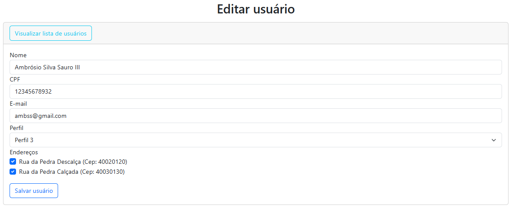
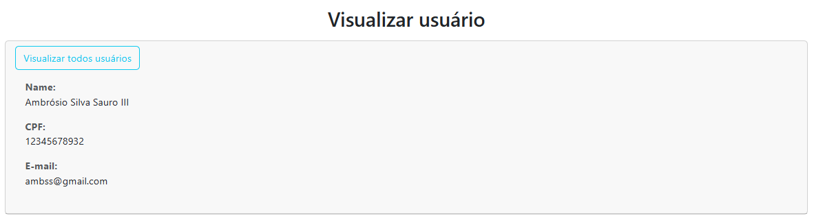
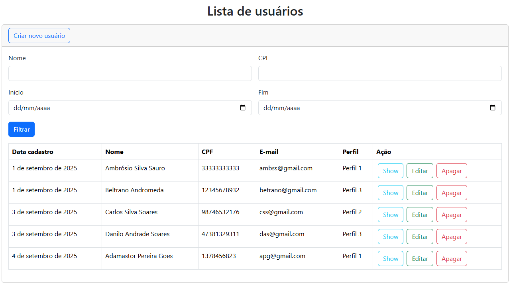
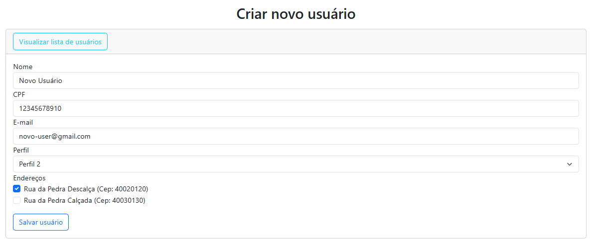
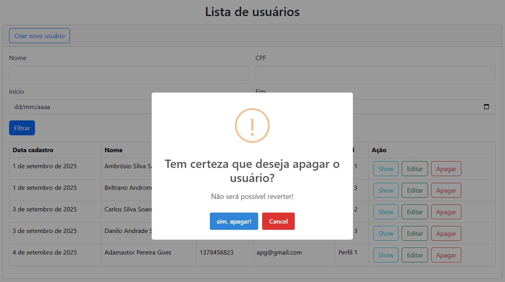

<h1 align="center">CRUD usuários</h1>

Uma aplicação CRUD de usuários com Perfil e Endereços utilizando Vue.js 3 e Bootstrap 5.

<p align="center">
		 
</p>

<p align="center">
	<a href="#computer-tecnologias">Tecnologias</a> •	
	<a href="#white_check_mark-features">Open features</a> •
	<a href="#runner-começando">Começando</a> •
	<a href="#warning-pré-requisitos">Pré-requisitos</a> •
	<a href="#hammer_and_wrench-instalação">Instalação</a> •
	<a href="#construction_worker-autor">Autor</a> •
	<a href="#memo-licença">Licença</a>
</p>

<p align="center">
	<kbd>
		
	</kbd>
	<br/><br/>
	<kbd>
		
	</kbd>
	<br/><br/>
    <kbd>
		
	</kbd>
	<br/><br/>
    <kbd>
		
	</kbd>
	<br/><br/>
    <kbd>
		
	</kbd>	
</p>

## :computer: Tecnologias

- [Vue.js 3](https://vuejs.org/)
- [Bootstrap 5](https://getbootstrap.com/)

## :white_check_mark: Open features

- [ ] Cadastro de endereços no formulário de cadastro de usuário;
- [ ] Filtro de usuários;
- [ ] Página de visualização do usuário com data do cadastro, perfil e sesu respectivos endereços;
- [ ] Exclusão de endereços sem associação com usuário;

## :runner: Começando

Essas instruções fornecerão uma cópia do projeto instalado e funcionando em sua máquina local.

## :warning: Pré-requisitos

O que você precisar para instalar a aplicação

```
Node >= 22.17.1
```

## :hammer_and_wrench: Instalação

Passos para rodar a aplicação

```
# Clonar
git clone https://github.com/tarcisioaraujo/vue-crud-user.git

# Acessar o diretório
cd vue-crud-user

# Instalar as dependências do Node JS
npm install

# Define variáveis
cp .env.example .env

# Rodar Servidor
npm run serve

# Acessar o endereço
http://localhost:8080
```

## :construction_worker: Autor

<a href="https://github.com/tarcisioaraujo">
 
 <br />
 <sub><b>Tarcísio Silva de Araújo</b></sub></a> <a href="https://github.com/tarcisioaraujo" title="GitHub"></a>

Feito por Tarcísio Silva de Araújo 👋

[](https://www.linkedin.com/in/tarcisiosaraujo/)
[](mailto:tarcisio.saraujo@gmail.com)

## :memo: Licença

Este projeto esta sobe a licença [MIT](./LICENSE).
